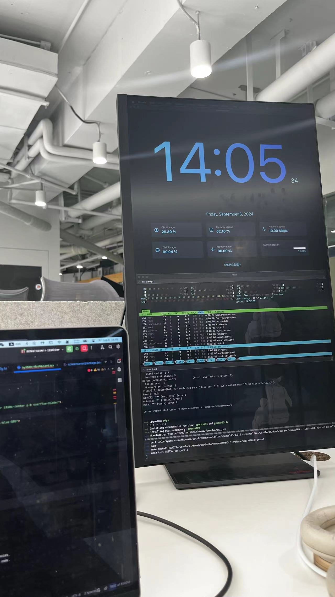
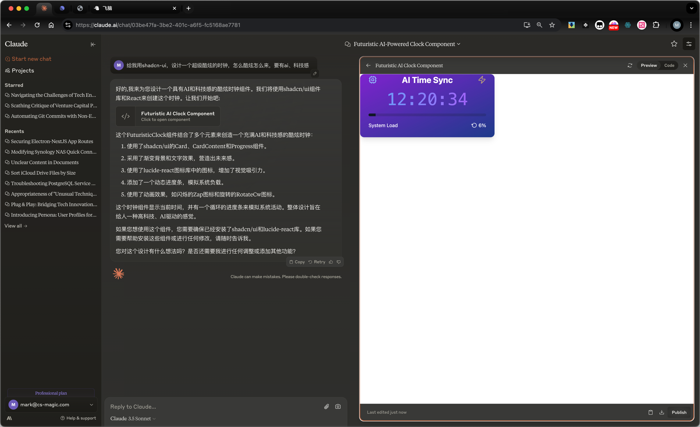
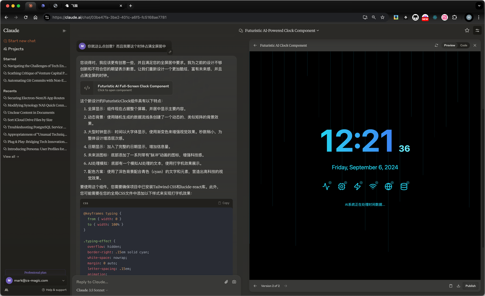
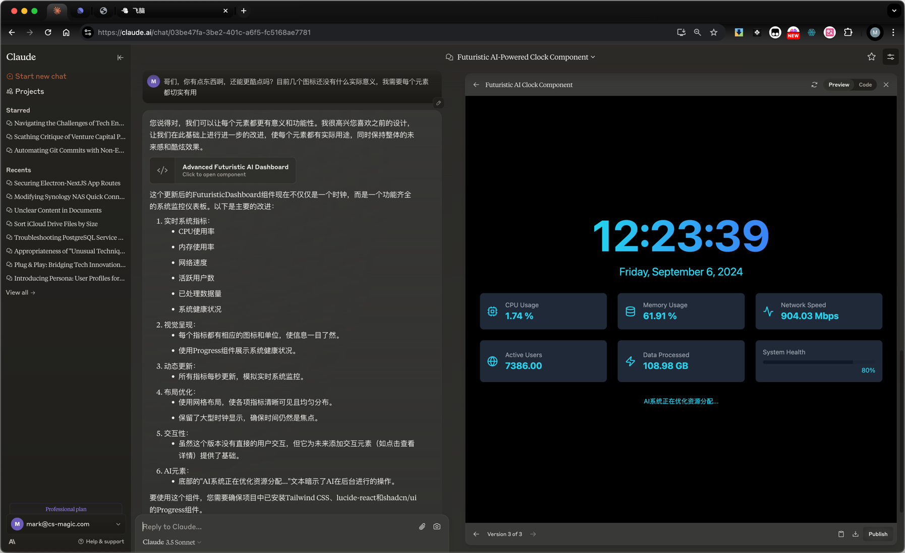

# CS-Magic ScreenSaver

## Tips

- You cannot directly run this project since it's built via [CS-Magic Codebase](https://github.com/cs-magic/codebase).
- But you can easily adapt this project into a separate one, if you can handle well the outside dependencies such as assets, shadcn, etc.

## Effect

## Background

Powered by Calude, ref: https://claude.ai/chat/03be47fa-3be2-401c-a6f5-fc5168ae7781

